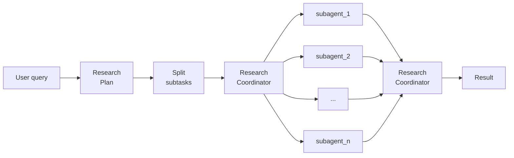

# Agentic Deep Research

A deep-research architecture that decomposes user queries into scoped subtasks, orchestrates specialized agents for parallel investigation, and aggregates the results into a unified, structured report.

## Architecture



## Set-up
### Use UV to handle dependencies and venv 

1. ```uv init```

2. ```uv venv```

3. ```source . venv/bin/activate```

4. ```uv add 'smolagents[mcp]' firecrawl huggingface_hub```

### Add your API keys to your ```.env```file:
```
HF_TOKEN="your_hf_token"
FIRECRAWL_API_KEY="your_firecrawl_api_key"
```
