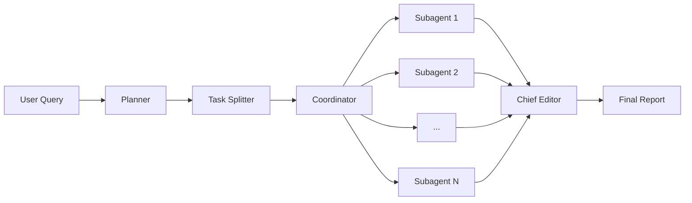

# Agentic Deep Research

A multi-agent deep research system that takes a user query, plans the research, splits it into subtasks, runs multiple agents **concurrently**, and synthesizes the results into a final structured report.

The system is built on top of **smolagents**, uses **Hugging Face Inference Providers**, and supports **parallel execution** of research agents for faster results.

---

## Overview

This project implements an agentic research workflow:

1. A **planner** generates a research plan.
2. The plan is split into structured subtasks.
3. Multiple **sub-agents run concurrently** to research each subtask.
4. A **chief editor agent** synthesizes all results into a final report.

The final output is written as a Markdown file.

---

## Architecture



---

## Key Features

* Parallel execution of sub-agents
* Structured task splitting using JSON schema
* Modular agent architecture
* Final synthesis with a dedicated editor agent
* Hugging Face Inference API support
* Firecrawl integration for web research
* Clean separation of responsibilities

---

## Requirements

* Python 3.11+
* `uv`
* Hugging Face account and token
* Firecrawl API key (optional, if web tools are enabled)

---

## Installation

### 1. Install dependencies

```bash
uv sync
```

### 2. Environment variables

Create a `.env` file:

```env
HF_TOKEN=your_huggingface_token
FIRECRAWL_API_KEY=your_firecrawl_api_key
```

---

## Running the Project

### Interactive mode

```bash
uv run main.py
```

You will be prompted for a research query.

### With a query argument

```bash
uv run main.py "Your research question here"
```

The final report will be written to:

```
research_result.md
```

---

## File Responsibilities

### `main.py`

Entry point. Loads configuration, reads user input, and starts the research pipeline.

### `coordinator.py`

Central orchestrator:

* Launches sub-agents concurrently
* Collects their outputs
* Runs the final synthesis step

### `planner.py`

Generates a high-level research plan from the user query.

### `task_splitter.py`

Splits the plan into structured subtasks using a JSON schema.

### `firecrawl_tools.py`

Defines web search and scraping tools used by agents.

### `utils/config_loader.py`

Loads configuration from YAML files.

### `utils/prompt_loader.py`

Loads prompt templates from the `prompts/` directory.

---

## Execution Model

* Subagents are executed **in parallel**
* Each agent works independently
* Failures are retried when possible
* Final synthesis merges all results into a coherent report

This design allows the system to scale well for complex research queries.

---

## Notes

* Models and providers can be changed in configuration files.
* The system is compatible with any Hugging Face Inference Provider model that supports chat completions.
* Designed for extensibility and experimentation.